# 2026 第四届中国脑机接口大赛 - 技术赛 - 基于感觉肌肉电刺激提示的上肢运动想象分类技术与系统赛决赛选手 README

## 1. 基本信息

1. 决赛采用 `1 台裁判机 + 多台选手机` 的多机结构，裁判机统一回放数据、统一计时、统一计分、统一保存结果。
2. 选手机只运行本队算法服务，默认必须监听本机 TCP `9981`，并能被裁判机访问。
3. 选手主要修改范围是 `app/Algorithm`，尤其是 `app/Algorithm/Algorithm/method/model_artifacts/baseline_example/AlgorithmImplement.py`。
4. 正式比赛的超时、得分和结果保存以裁判机为准，本机日志只用于排障。
5. 在线阶段由裁判机统一放行，多队共享同一批 trial数据；
6. 比赛开始前必须让算法先启动并保持连接；如果某个 task 已经开始后才接入，该 task 按 timeout 处理。

> [!CAUTION]
>
> 1. 决赛算法整体预测流程在180分钟左右
> 2. 如果现场多赛队同时分发出现卡顿，可能会抽签分组运行（相同数据和顺序，不影响结果）

## 2026 届现场决赛结果

2026届现场决赛单次正常运行，无回退，暂停，重赛， 所有赛队无大范围超时。

### 结果：

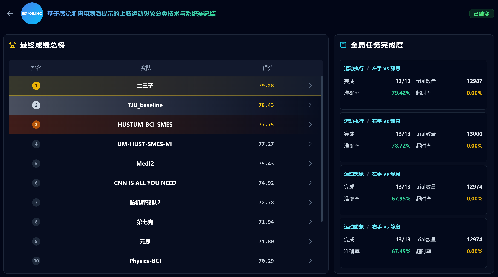

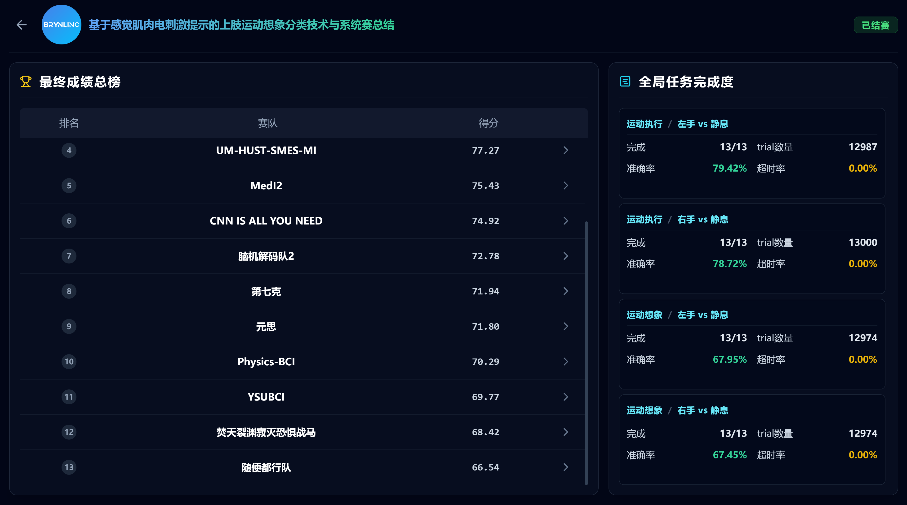

## 2. 初赛/调试链路与决赛链路的区别

| 维度 | 初赛/本地调试 | 决赛/ |
| --- | --- | --- |
| 机器结构 | 单机运行 | `1 台裁判机 + 多台选手机` |
| 启动入口 | `debug/debug_pipeline.py`、`startup.bat` | 选手机 `startup_team.bat`，裁判机 `startup_judge_clear.bat` |
| 算法位置 | 与回放、计分在同一台机器 | 只在选手机运行 |
| 数据回放 | 本机 `.dat` 回放 | 裁判机统一回放并分发 |
| online 同步 | 本机调试为主 | `RuntimeStageCoordinator` 统一放行 |
| 计时基准 | 本机时间 | 裁判机时间 |
| 成绩 | 本机保存 | 裁判机保存的官方结果 |

## 3. 决赛架构

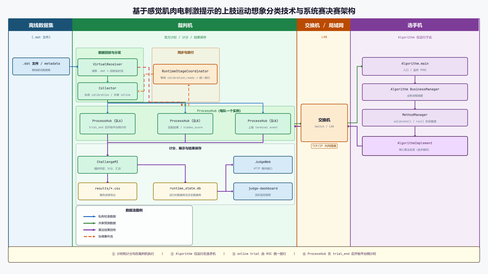

裁判机负责：

- `Collector`：读取离线数据，切分 calibration 和 online，向各队发送数据。
- `RuntimeStageCoordinator`：等待同组各队校准完成，统一放行 online stage 和 trial。
- `ProcessHub`：每队一个，连接对应选手机算法，做平台侧 trial 计时、超时处理和结果封装。
- `ChallengeMI`：统一计分。
- `JudgeWeb` / `judge-dashboard`：实时状态页、排行榜和总结页。
- `results/`：官方结果保存目录。

选手机负责：

- 启动 `startup_team.bat`。
- 接收裁判机发送的 calibration 数据。
- 接收裁判机发送的 online 数据。
- 在规定时间内返回预测结果。

正式数据流：

1. 裁判机 `VirtualReceiver` 从 `.dat` 文件回放数据。
2. `Collector` 为每队发送私有 calibration 数据。
3. 算法完成当前 session 校准后，上报 `calibration_ready`。
4. `RuntimeStageCoordinator` 等待同组所有队伍 ready。
5. 裁判机开始发送共享 online trial。
6. `ProcessHub` 在看到 `trial_end` 后开始平台侧计时。
7. 算法返回预测结果。
8. `ProcessHub + ChallengeMI` 完成 trial 匹配、超时判定、计分和落盘。
9. `JudgeWeb` / `judge-dashboard` 展示实时状态和排行榜，页面刷新可能有轻微延迟， **实际用的时候可能会出现页面跳trial的现象，为刷新延迟**。

数据源名含义：

- `eeg_1_calibration_private`：每队私有 calibration 数据。
- `eeg_1_online_shared`：所有队共享 online 数据。
- `hidden_score`：裁判机私有真值旁路，算法端不可见。

## 4. 允许修改和不建议修改的内容

建议修改：

- `app/Algorithm/Algorithm/method/model_artifacts/...`
- `app/Algorithm/Algorithm/method/model_artifacts/baseline_example/AlgorithmImplement.py`
- 你的算法依赖的其他 Python 文件。
- `app/requirements.txt` 依赖项。

不要随意修改：

- 算法监听端口 `9981`。
- 默认 source label `eeg_1`。
- `get_required_channel_labels()` 的返回结构。
- 框架内部的 `run()` 在线循环包装层。
- 裁判机、Collector、ProcessHub、Challenge、JudgeWeb 相关代码。

如果确实需要改框架层代码，请在提交前明确说明原因、影响范围和回退方法。

## 5. 算法入口和必须保留的接口

算法主入口配置文件是：

```text
app/Algorithm/Algorithm/config/AlgorithmConfig.yml
```

正式运行时该文件只保留框架固定值展示，不作为比赛参数入口。当前固定入口为：

```yml
connection:
  rpc_address: '[::]:9981'

method:
  method_class_file: Algorithm/method/model_artifacts/baseline_example/AlgorithmImplement.py
  method_class_name: AlgorithmImplement
```

替换算法实现后，必须保证：

- `python -m Algorithm.main` 能正常启动。
- 算法服务仍监听 `9981`。
- `get_required_channel_labels()` 返回合法通道列表。
- `calibrate()` 保留为 session 同步入口。
- `predict()` 能处理单个完整 trial，并返回合法预测结果。

推荐只把以下位置当成主要改动入口：

- `AlgorithmImplement.__init__()`：初始化模型、参数、所需通道和校准申请值。
- `AlgorithmImplement.calibrate()`：处理当前 session 的校准数据。
- `AlgorithmImplement.predict()`：处理单个 online trial 并返回预测。

推荐预测输出格式与 baseline 保持一致：

```json
{"predict_label": 0}
```

## 6. 可申请参数

### 6.1 通道数量

通道声明来自 `get_required_channel_labels()`，正式运行只允许 source label 为 `eeg_1`。返回格式示例：

```python
def get_required_channel_labels(self) -> dict[str, list[str]]:
    return {
        "eeg_1": ["C3", "C4", "FC3", "FC4", "CP3", "CP4", "CZ", "PZ"],
    }
```

约束：

- `eeg_1` 必须存在。
- 至少声明 1 个通道。
- 每个 source 最多 8 个通道。
- 通道名不能重复，不能为空。
- 框架会按声明列表筛选和重排通道，并自动上报 `requested_channel_labels` 和 `requested_channel_count`。

### 6.2 每类校准 trial 数量

baseline 在 `AlgorithmImplement.__algorithm_config` 中提供示例：

```python
self.__algorithm_config = {
    "calibration_trials_per_class_requested": 7,
    ...
}
```

约束：

- 合法范围是整数 `0 ~ 10`。
- 申请数量越少，校准分越高。
- 申请 `0` 时也必须保留 `calibrate()`，因为它仍承担阶段同步职责。

### 6.3 模型目录大小

所有参与在线推理的静态模型参数、模板、权重和统计量，必须位于：

```text
app/Algorithm/Algorithm/method/model_artifacts
```

规则：

- 模型大小不能由 `AlgorithmImplement` 自报。
- 框架启动时会统计 `model_artifacts` 目录大小，并向裁判机上报 `platform_model_size_mb`。
- 如果目录不存在或包含软链接、junction、快捷方式等重解析点，框架会拒绝统计，该项可能不纳入计分或触发排查。
- 不允许把模型放到目录外再映射回来。
- 不允许比赛时在线下载模型、参数或统计量。

## 7. calibration 与 online 阶段

### 7.1 calibration 阶段

- `Collector` 不会无条件发送全部 calibration trial。
- 当前规则是每类最多提供前 `10` 个 calibration trial 作为候选池。
- 各队可申请不同校准数量，online 测试集保持一致。
- 每个 session 的 calibration 数据按阶段发送，算法完成后上报 `calibration_ready`。

如果算法不需要训练，正确做法是保留 `calibrate()` 的阶段同步逻辑，读取并确认当前 calibration 包，然后直接返回 ready。不要删除 `calibrate()`，也不要绕过 `get_calibration()`。

### 7.2 online 阶段

- online 数据由裁判机统一共享发送。
- 同组所有队伍当前 session 校准 ready 后，裁判机才会统一放行。
- `ProcessHub` 以平台侧 `trial_end -> 收到算法结果` 的 wall clock 差值计算反应时。
- 超时判定完全以裁判机为准。
- 晚到结果会被丢弃，不会补记。

### 7.3 真值与计分

- 真值不会发给算法。
- `VirtualReceiver` 通过 `hidden_score` 私有旁路把真值送给裁判机侧 task/challenge。
- `ChallengeMI` 根据算法结果、隐藏真值和平台侧运行时统一计分。

## 8. 评分原则

当前默认 task 顺序：

- `vme_left_vs_rest`
- `vme_right_vs_rest`
- `vmi_left_vs_rest`
- `vmi_right_vs_rest`

单个 task 的得分由 5 部分组成：

- 精度分 `Sper`
- 反应时分 `Stime`
- 通道分 `Schannel`
- 校准分 `Scal`
- 模型大小分 `Ssize`

当前默认上限：

- `accuracy_score_max = 80`
- `reaction_time_score_max = 2`
- `channel_score_max = 8`
- `calibration_score_max = 7`
- `model_size_score_max = 3`

当前默认参考值：

- `reaction_time_reference_ms = 1000`
- `channel_reference_count = 8`
- `calibration_reference_trials_per_class = 10`
- `model_size_reference_mb = 150`
- `accuracy_stability_penalty_lambda = 0.5`

当前实现公式：

```text
Sper = 80 * max(0, (mu_accuracy_percent - 0.5 * sigma_accuracy_percent) / 100)
Stime = clip(2 * (1 - avg_rt_ms / 1000), 0, 2)
Schannel = clip(8 * (8 - channel_count) / 7, 0, 8)
Scal = clip(7 * (1 - calibration_trials_per_class / 10), 0, 7)
Ssize = clip(3 * (1 - model_size_mb / 150), 0, 3)
task_score = Sper + Stime + Schannel + Scal + Ssize
```

总分规则：

- 每个 task 有 baseline 分数，当前默认是 `0`。
- `adjusted_task_score = task_score if task_score >= baseline else 0`。
- 完整比赛结束后，总分是各 task `adjusted_task_score` 的平均值。
- 比赛进行中页面可能按已开始 task 展示即时均值，最终以裁判机保存结果为准。

## 9. 超时规则

当前正式配置：

- 预测窗：`1.0s`
- trial 周期：`1.3s`
- 超时标签：`wrong`

如果算法没有在官方预测窗内返回结果：

- 该 trial 记为 timeout。
- 该 trial 视为错误预测。
- 反应时按平台侧 timeout 上限处理。
- 晚到结果不会补记。

`predict_timeout_seconds` 由裁判机下发和判定，不应作为选手自定义比赛参数上报。

## 10. 选手机启动与关闭

比赛当天，选手机通常只需要双击：

```text
startup_team.bat
```

该脚本会：

- 查找可用 Python。
- 关闭已有 `[BCI Team]` 算法窗口。
- 尝试清理占用 `9981` 的旧监听进程。
- 检查 `9981` 是否可用。
- 尝试添加 Windows 防火墙入站规则 `BCI Competition Algorithm 9981`。
- 在 `app/Algorithm` 目录启动 `python -m Algorithm.main`。

正常会出现窗口：

```text
[BCI Team] Algorithm Python
```

不要在比赛过程中关闭该窗口、切换网络、重启 Python 环境或临时修改代码。

关闭算法时使用：

```text
shutdown_team.bat
```

或者直接关闭窗口就行。


## 11. 选手机环境要求

至少满足：

- Windows 环境。
- 可用 Python。
- 已安装 `app/requirements.txt`。
- 与裁判机处于同一有线局域网。
- 本机 TCP `9981` 可被裁判机访问。

示例：

- 裁判机：`10.11.11.101`
- 本机（某台选手机）：`10.11.11.102`
- 子网掩码：`255.255.255.0`
- 默认网关：留空
- DNS：留空

在选手机上可按以下步骤设置：
1. 关闭wifi、防火墙、杀毒软件、虚拟机、wsl等可能干扰网络连接的服务， 如果有移动网卡， 请记得拔出

2. 按 `Win + R`。

3. 输入 `ncpa.cpl` 并回车。

   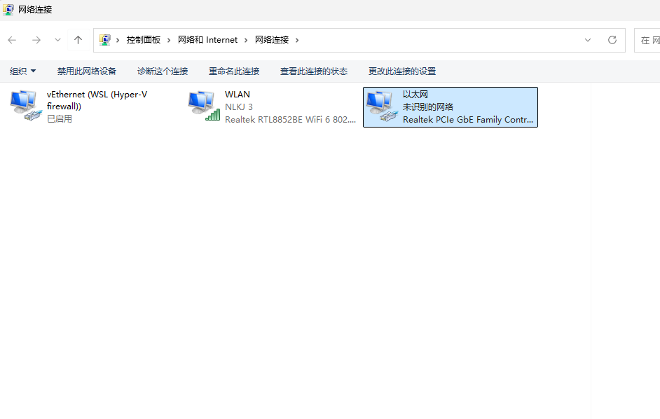

4. 找到当前接交换机的 `以太网`。

5. 右键 `以太网`，点击 `属性`。

6. 双击 `Internet 协议版本 4 (TCP/IPv4)`。

   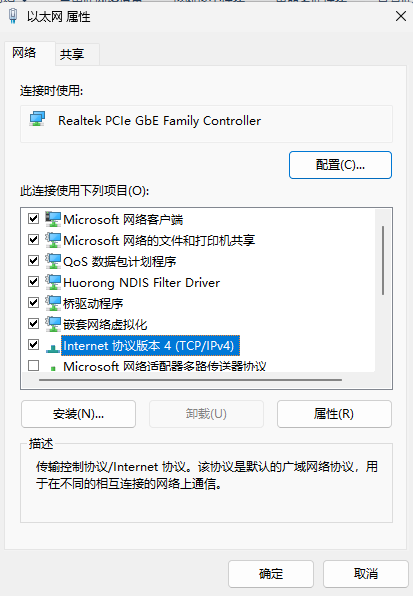

7. 选择“使用下面的 IP 地址”。

8. 按裁判组分配结果填写：
   - `IP 地址`：例如 `10.11.11.102`， 该地址将根据抽签顺序， 由裁判组提供给各位选手， 如不知情，请及时联系裁判
   - `子网掩码`：`255.255.255.0`
   - `默认网关`：留空
   - `DNS`：留空

   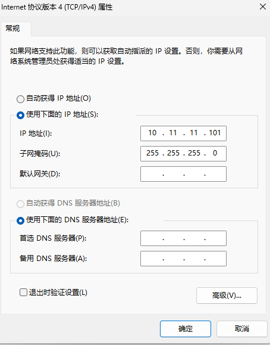

9. 点击“确定”保存。

设置完成后建议执行：

```powershell
ipconfig
```

`Win + R` 输入cmd, 之后输入ping 10.11.11.101（**这个地址请与裁判确认**）, 查看是否能连通裁判机


只确认 `以太网适配器` 下的 `IPv4 地址`，不要把 `Wi-Fi`、`vEthernet`、`127.0.0.1` 或 `169.254.x.x` 误报给裁判组。

检查配置相关：

```powershell
pip install -r app/requirements.txt
python -c "import torch; print(torch.__version__)"
python -c "import torch; print(torch.cuda.is_available())"
```

如果依赖 GPU，请提前确认：

- CUDA 版本。
- 显卡驱动版本。
- 现场机器是否具备相同环境。
- 是否有 CPU fallback。

## 12. 比赛当天建议操作顺序

1. 将算法文件和模型工件放到官方仓库规定位置。
2. 确认 `AlgorithmImplement.py` 中的通道声明、校准申请值和模型路径符合规则。
3. 断网， 关闭 Wi-Fi，拔出移动网卡，关闭防火墙，关闭VPN和杀毒软件。
4. 确认连接电源，电源设置中不休眠，不息屏。
5. 如现场要求固定 IP，先按裁判组分配结果设置本机 `以太网` IPv4 地址。
6. 向裁判组确认本机IP端口， 之后裁判会手动ping端口，确保ping通后即可。
7. 确认 `startup_team.bat`中python位置是否修改正确。
8. 双击 `startup_team.bat`。
9. 保持 `[BCI Team] Algorithm Python` 窗口开启（ 如果现场出现问题，可能会多次重启，请见谅；连接上后不要关闭选手机窗口）
10. 等待裁判机连接和开赛。

## 13. 赛前自检清单

至少确认：

- `startup_team.bat` 能正常拉起算法。
- `python -m Algorithm.main` 能在 `app/Algorithm` 目录下独立启动。
- `9981` 没有被防火墙阻断。
- 算法能在 `1.0s` 内稳定返回结果。
- `calibrate()` 和 `predict()` 都跑通过。
- `get_required_channel_labels()` 合法且不超过 8 通道。
- `calibration_trials_per_class_requested` 是 `0 ~ 10` 的整数。
- 所有静态模型都位于 `model_artifacts`。
- 不依赖目录外隐藏参数、在线下载模型或人工临场操作。

## 14. 常见问题

### 14.1 算法启动失败

优先检查：

- Python 是否可用。
- 是否已安装 `app/requirements.txt`。
- `AlgorithmImplement.py` 是否有语法错误或导入错误。
- `9981` 是否被其他程序占用。
- `app/Algorithm/Algorithm/log/algorithm.log` 是否有异常。

### 14.2 裁判机显示本队未连接

优先检查：

- `[BCI Team] Algorithm Python` 窗口是否仍在。
- 本机 IP 是否交给裁判组。
- 是否误连 Wi-Fi 或切换了网络。
- Windows 防火墙是否拦截 `9981`，建议关闭防火墙
- 裁判机是否能 ping 通本机 IP。

### 14.3 当前 task 被 timeout

常见原因：

- 算法启动太晚，task 已经开始。
- 当前 task 中途掉线。
- `predict()` 超过 `1.0s` 才返回。
- GPU 首次推理过慢，未提前 warm up。
- 返回格式不合法或无法匹配 trial。

==当前 task 中途掉线不是无损恢复，系统会在下一个 task 尝试重新纳入。==

### 14.4 本机分数与官方页面不一致

以裁判机为准。官方结果主要保存于：

```text
results/runtime_state.db
results/00_team_score_overview.csv
results/<team_id>/03_trial_records.csv
```

后续如果需要，可以提供。

选手机日志只用于排障，不作为官方成绩依据。

## 15. 提交前提醒

提交前请再次确认：

1. 没有修改裁判机侧逻辑来适配本队算法。
2. 没有把模型或统计量放在 `model_artifacts` 之外。
3. 没有依赖比赛网络下载资源。
4. 没有绕过 `calibrate()` 阶段同步。
5. 没有把通道数、校准数量、模型大小等评分参数改成自报口径。

## 16. 重赛与回退

如果现场出现大面积掉线或超过赛事规则允许范围，应由裁判决定是否暂停，并按指定阶段重跑流程回退。回退阶段及旧结果不应作为最终成绩依据。

## 17. 现场环境问题

地点：

北京市中关村国家自主创新示范区展示中心 - 新建宫门路 2 号展示交易中心 3 号门

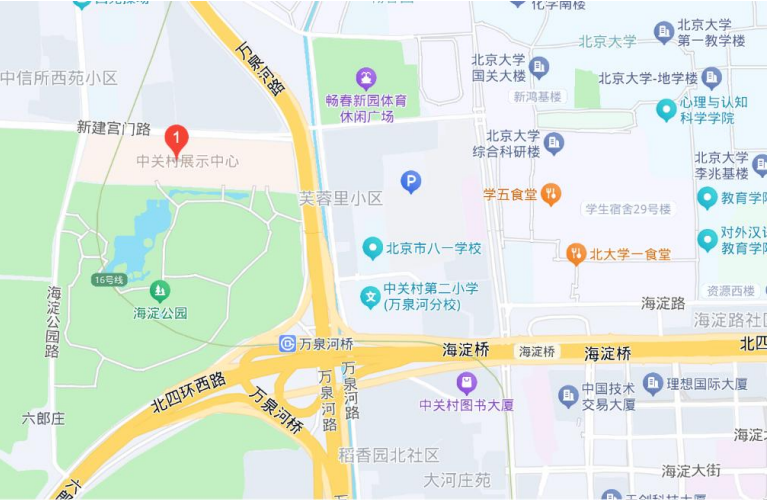

时间：

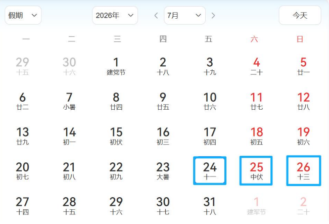

​	7月23日 赛队报道、赛题备赛和设备调试

​	7月24日 开幕式及算法答辩

​	7月25日 决赛算法比赛

​        7月26日 颁奖仪式和闭幕式

决赛比赛位置：

> [!NOTE]
>
> 1. 决赛比赛位置在展示区和主舞台中间， 可能会有噪音
>
> 2. 请注意现场观众，尽量避免触碰竞赛电脑，主办方和出题方会协助维持秩序， 但主要靠赛题选手自行保证， 请务必至少留守一人

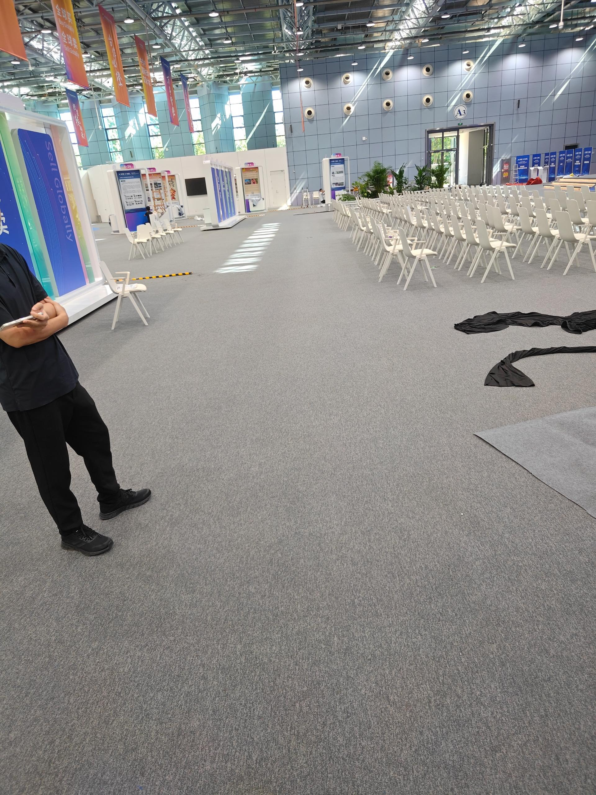

决赛答辩位置：

会议室或路演室

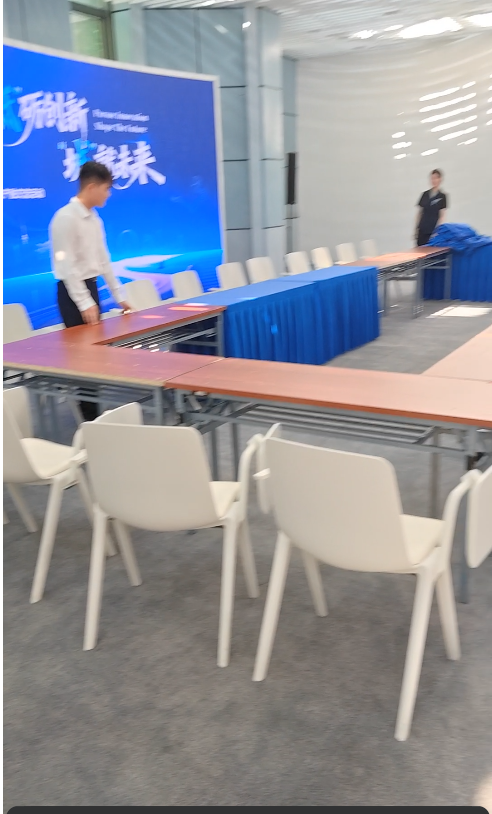


### 17.1 电源及供电问题

1. 现场场馆不确保存在稳压电源，为确保赛事进行顺利，建议自备移动电源，并保持电量充足（**这点现场并未存在，之后可忽略）**
2. 确保电脑电源选项开启高性能模式

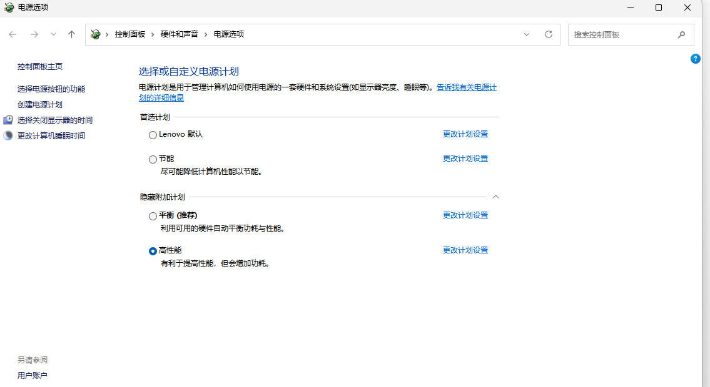

3. 请注意尽量不要与其他赛队共用插线板，会出现电压/电流不稳，性能降低问题 **（这点现场并未存在，之后可忽略）**


### 17.2 交换机问题

1. 现场不提供线组轧带，请确保交换机网线连接正常， **谨防踢掉网线的情况发生** (现场比赛开始后，选手和裁判退至场地外，无意外情况发生)


### 17.3 网络问题

1. 现场使用WIFI进行，很可能出现网络不稳定情况或没有网络， 强烈建议提前配置好环境

2. 通过蓝牙传输也可能存在干扰
